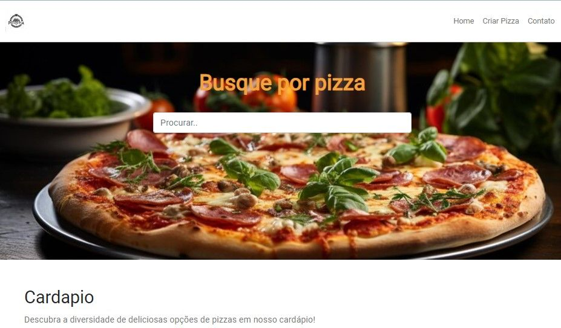
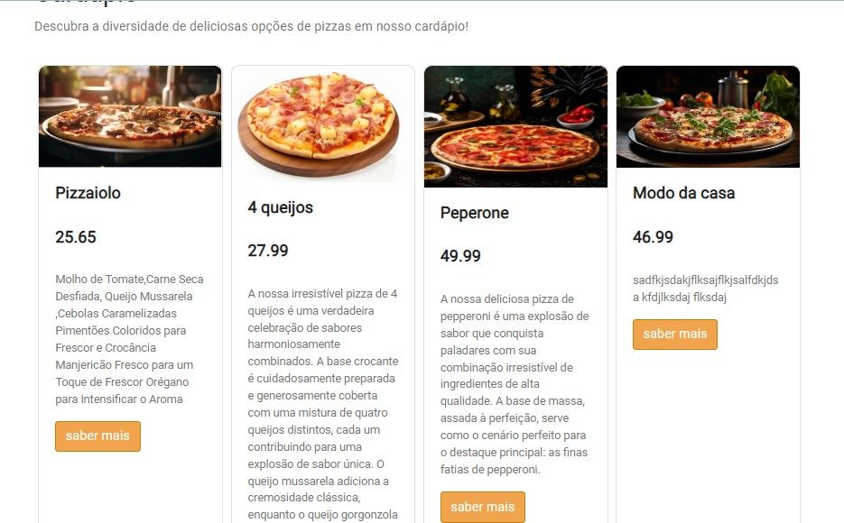

# Projeto Laravel Pizzaria

Este projeto Laravel visa criar um site para uma pizzaria, oferecendo funcionalidades básicas, como visualização de pizzas, cadastro de novas pizzas e uma página de contato.

Páginas Principais

Página Inicial (Index)
A página inicial apresenta um filtro de pizzas, permitindo aos usuários navegar e encontrar suas pizzas favoritas.
Além disso, exibe um menu completo de todas as pizzas disponíveis no site.

Ao clicar sobre a pizza, aparecera mais detalhes :

Página de Cadastro
A página de cadastro oferece a funcionalidade de adicionar novas pizzas ao catálogo.
Os usuários podem preencher informações relevantes sobre a pizza, como nome, ingredientes e preço, para serem exibidas posteriormente na página inicial.

Página de Contato
A página de contato fornece um meio de comunicação direta com a pizzaria.

Os usuários podem utilizar formulários para enviar mensagens, fazer perguntas ou fornecer feedback sobre o site ou seus produtos.
Como Executar o Projeto

Requisitos do Ambiente

Certifique-se de ter o ambiente PHP e Laravel configurado.
Instale as dependências do projeto usando composer install.
Configuração do Banco de Dados

Configure o arquivo .env com as informações do seu banco de dados.
Execute as migrações para criar as tabelas necessárias: php artisan migrate.
Executando o Servidor Localmente

Inicie o servidor local com o comando: php artisan serve.
Acesse o projeto no navegador através do endereço gerado.
Contribuições e Problemas

Contribuições são bem-vindas! Se você encontrar problemas ou tiver sugestões para melhorias, sinta-se à vontade para abrir uma issue neste repositório.

Esperamos que este projeto Laravel para a pizzaria seja útil e atenda às suas necessidades. Aproveite a construção de uma experiência deliciosa para os amantes de pizza!

Reformulações

Adicionei uma imagem de pizza no início do README para chamar a atenção do leitor.
Reorganizei o conteúdo para facilitar a leitura.
Adicionei links para as seções principais do README para facilitar a navegação.
Corrigi erros de ortografia e gramática.
Sugestões

Você pode adicionar mais informações sobre as funcionalidades do projeto, como detalhes sobre o filtro de pizzas ou o formulário de contato.
Você pode adicionar uma seção sobre a licença do projeto.
Você pode adicionar uma seção sobre como testar o projeto.
